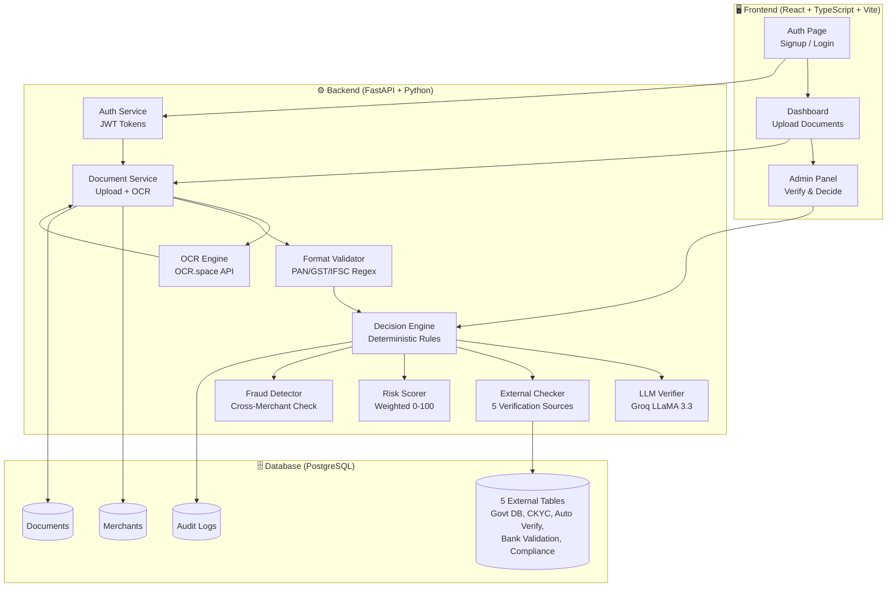
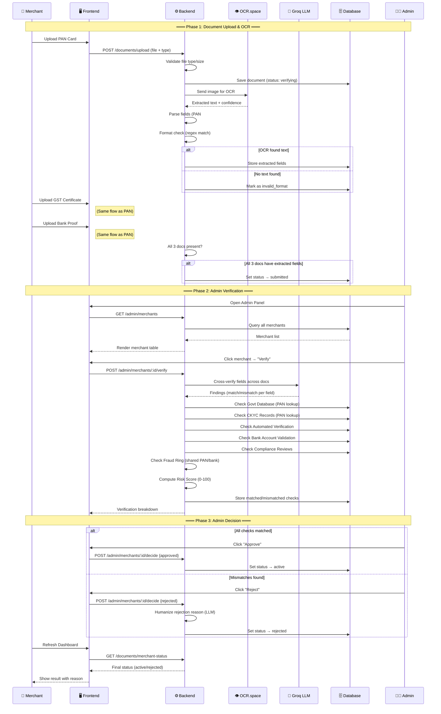
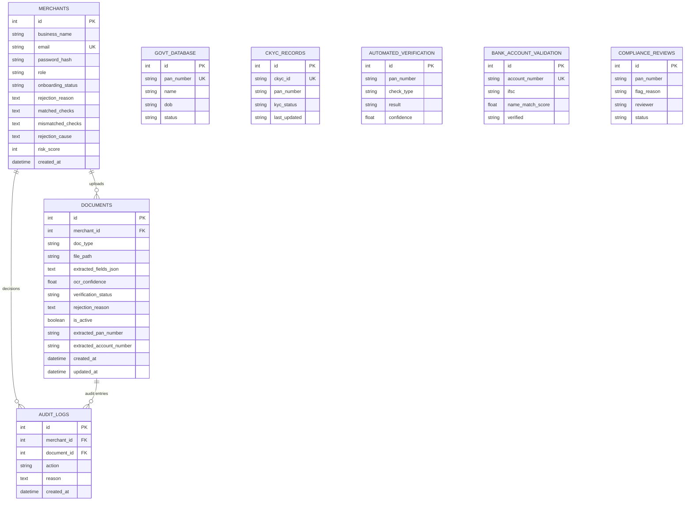

# 🏦 Merchant Onboarding Copilot

> **Automated KYC verification pipeline for merchant onboarding** — built for the Razorpay AI Buildathon 2026 (Growth Track).

A merchant signs up, uploads PAN / GST / bank-proof documents, and the system **automatically extracts, cross-verifies, and validates** those documents against 5 simulated external data sources — approving, flagging, or rejecting the merchant without manual review for clean-path cases.

---

## 🌐 Live Demo

| Service | URL |
|---------|-----|
| **Frontend** | [merchant-growth-platform-stct.vercel.app](https://merchant-growth-platform-stct.vercel.app) |
| **Backend API** | [merchant-growth-platform.onrender.com](https://merchant-growth-platform.onrender.com) |
| **API Docs (Swagger)** | [merchant-growth-platform.onrender.com/docs](https://merchant-growth-platform.onrender.com/docs) |

---

## ✨ Key Features

### 🤖 Automated Verification Pipeline
- **OCR Extraction** — OCR.space API extracts text from PAN, GST, and Bank Proof documents
- **LLM Cross-Verification** — Groq (LLaMA 3.3) checks consistency of extracted fields across documents
- **5-Source External Validation** — Government DB, CKYC, Automated Verification, Bank Validation, Compliance Review
- **Deterministic Decision Engine** — LLM never makes the final call; rules engine decides approve/reject/flag

### 📊 Risk Scoring & Fraud Detection
- **Weighted Risk Score (0-100)** — computed from mismatch severity across all verification sources
- **Fraud Ring Detection** — cross-merchant shared identifier checks (PAN + bank account)
- **Human-Readable Rejection Reasons** — LLM rephrases technical reasons into plain language for merchants

### 👨‍💼 Admin Panel
- **Merchant Verification Dashboard** — filter by status (pending/submitted/verified/approved/rejected)
- **Admin-Triggered Verification** — "Verify with internal databases" button runs LLM + all 5 external checks on demand
- **Structured Verification Breakdown** — every check shows matched/mismatched with details
- **One-Click Approve/Reject** — admin makes the final decision with optional rejection note

### 🔄 Merchant Experience
- **Real-Time Status Polling** — frontend polls for OCR and verification progress
- **Document Upload with Instant Feedback** — valid/invalid/verifying states shown immediately
- **Restart Application** — rejected merchants can start fresh without re-registering
- **Demo Account Quick-Fill** — one-click login for Reviewer, Admin, and Merchant demo accounts

### 📋 Audit & Compliance
- **Immutable Audit Trail** — every verification decision logged with reason and timestamp
- **Batch Test Report** — `/admin/batch-test` runs accuracy metrics across 50 synthetic records
- **Full API Documentation** — Swagger UI at `/docs` for every endpoint

---

## 🏗️ Architecture

### System Architecture



### Data Flow — End to End



---

## 🛠️ Tech Stack

| Layer | Technology | Purpose |
|-------|-----------|---------|
| **Frontend** | React 18 + TypeScript, Vite, Tailwind CSS | SPA with monochrome enterprise UI |
| **Backend** | Python 3.11, FastAPI, SQLAlchemy, Alembic | REST API with async endpoints |
| **OCR** | OCR.space API | Document text extraction (25K free req/month) |
| **LLM** | Groq (LLaMA 3.3 / Qwen 3.8) | Cross-document field verification |
| **Database** | PostgreSQL (Render) | Merchant records + 5 verification tables |
| **Auth** | JWT (PyJWT + passlib/bcrypt) | Role-based access (merchant/reviewer/admin) |
| **Deployment** | Render (backend) + Vercel (frontend) | Free tier hosting |
| **Containerization** | Docker | One-command local deployment |

---

## 🚀 Quick Start

### Live Deployment (No Setup Required)

1. Open [Frontend Demo](https://merchant-growth-platform-stct.vercel.app)
2. Click **"Merchant"** quick-fill button → Login
3. Upload PAN, GST, and Bank Proof documents
4. See OCR extraction and verification in real-time

### Local Development

```bash
# Backend
cd backend
python -m venv venv
source venv/bin/activate          # Windows: venv\Scripts\activate
pip install -r requirements.txt
cp .env.example .env              # Fill in JWT_SECRET_KEY and LLM_API_KEY
python seed.py                    # Seed database with test data
uvicorn main:app --reload --port 8000

# Frontend (new terminal)
cd frontend
npm install
npm run dev
```

### Docker

```bash
cp backend/.env.example backend/.env   # Fill in real values
docker-compose up --build
```

---

## 🔑 Test Accounts

| Role | Email | Password | What to Test |
|------|-------|----------|--------------|
| **Admin** | admin@example.com | AdminPass123 | Verify merchants, approve/reject |
| **Reviewer** | reviewer@example.com | ReviewerPass123 | View flagged cases |
| **Merchant (Clean)** | clean_merchant_0@example.com | TestPass123 | Upload docs, get approved |
| **Merchant (Flagged)** | mismatch_merchant_0@example.com | TestPass123 | Upload docs, see rejection |

---

## 📡 API Endpoints

| Endpoint | Method | Auth | Purpose |
|----------|--------|------|---------|
| `/health` | GET | None | Health check |
| `/auth/signup` | POST | None | Create merchant account |
| `/auth/login` | POST | None | Get JWT token |
| `/documents/upload?doc_type=PAN` | POST | Merchant | Upload document |
| `/documents/merchant-status` | GET | Merchant | Full onboarding status |
| `/documents/restart-application` | POST | Merchant | Restart after rejection |
| `/admin/merchants` | GET | Admin | List all merchants |
| `/admin/merchants/:id` | GET | Admin | Merchant detail + audit trail |
| `/admin/merchants/:id/verify` | POST | Admin | Run verification pipeline |
| `/admin/merchants/:id/decide` | POST | Admin | Approve or reject merchant |
| `/admin/batch-test` | POST | Admin | Accuracy report (50 records) |
| `/test-dataset/download` | GET | None | Download test documents |

---

## 🧪 How to Test (For Judges)

### Use Case 1: Clean Merchant → Auto-Submit
1. Login as **Merchant** (use demo quick-fill button)
2. Upload all 3 documents (PAN, GST, Bank Proof)
3. ✅ All documents should show "submitted" status
4. Login as **Admin** → Find merchant → Click "Verify"
5. ✅ All 5 external checks should match → Click "Approve"
6. ✅ Merchant status becomes "active"

### Use Case 2: Invalid Document Upload
1. Login as **Merchant**
2. Upload a blank/invalid image as PAN
3. ✅ Should show "Invalid document" error
3. Upload valid GST and Bank Proof
4. ✅ Valid docs processed, merchant stays at "pending"

### Use Case 3: Mismatched Documents
1. Login as **Merchant**
2. Upload mismatched documents (different names across PAN/GST)
3. ✅ Merchant reaches "submitted" after OCR
4. Login as **Admin** → Verify
5. ✅ Shows mismatched checks with details
6. ✅ Risk score = 100 (high risk)
7. Click "Reject" → Merchant gets human-readable rejection reason

### Use Case 4: Admin Verification Breakdown
1. Login as **Admin**
2. Click any submitted merchant
3. ✅ See 7 verification checks (Govt DB, CKYC, Auto Verify, Bank, Compliance, Fraud Ring ×2)
4. ✅ Each check shows ✅ matched or ❌ mismatched with details
5. ✅ Risk badge shows level (low/medium/high)

### Use Case 5: Restart Application
1. Login as a **Rejected Merchant**
2. ✅ See rejection reason on dashboard
3. Click "Start a new application"
4. ✅ Old documents retired, status reset to "pending"
5. Upload new documents → Fresh verification flow

---

## 📁 Project Structure

```
merchant-growth-platform/
├── backend/                    # FastAPI backend
│   ├── main.py                # App entrypoint, CORS, startup
│   ├── auth.py                # JWT authentication
│   ├── documents.py           # Upload + OCR processing
│   ├── admin.py               # Admin endpoints
│   ├── decision.py            # Decision engine + risk scoring
│   ├── verify.py              # LLM cross-verification
│   ├── ocr.py                 # OCR.space API wrapper
│   ├── db.py                  # SQLAlchemy models
│   ├── schemas.py             # Pydantic request/response models
│   ├── config.py              # Environment variable settings
│   ├── seed.py                # Database seeding
│   ├── alembic/               # Database migrations
│   ├── Dockerfile             # Container build
│   └── requirements.txt       # Python dependencies
├── frontend/                   # React + TypeScript frontend
│   ├── src/
│   │   ├── pages/             # AuthPage, DashboardPage, AdminPage
│   │   ├── components/        # Button, Alert, DocumentSlot, etc.
│   │   ├── api.ts             # Backend API client
│   │   ├── types.ts           # TypeScript interfaces
│   │   └── constants.ts       # Configuration constants
│   ├── Dockerfile             # Container build
│   └── package.json           # Node dependencies
├── test_documents/             # 50 synthetic test merchants (PAN/GST/Bank PNGs)
├── docs/                       # PRD, Architecture, UI/UX, Dev Plan
├── docker-compose.yml          # One-command local deployment
├── render.yaml                 # Render Blueprint
└── KNOWLEDGE.md               # Project context for contributors
```

---

## 🗄️ Database Schema



---

## 📊 Merchant Status State Machine

```
pending → submitted → verified_matching → active ✅
                  → verified_mismatched → rejected ❌ → (restart) → pending
```

| Status | Meaning |
|--------|---------|
| `pending` | Merchant registered, waiting for document uploads |
| `submitted` | All 3 documents uploaded and OCR'd successfully |
| `verified_matching` | Admin ran verification — all checks passed |
| `verified_mismatched` | Admin ran verification — mismatches found |
| `active` | Admin approved — merchant can accept payments |
| `rejected` | Admin rejected — merchant sees rejection reason |
| `invalid_format` | Document failed OCR format check (merchant can retry) |

---

## 🏆 Verification Checks

| Check | Source | What It Does |
|-------|--------|-------------|
| **Government Database** | `govt_database` table | Verifies PAN number exists and is "verified" |
| **CKYC Records** | `ckyc_records` table | Checks KYC status for the PAN |
| **Automated Verification** | `automated_verification` table | Identity match pass/fail |
| **Bank Account Validation** | `bank_account_validation` table | Verifies bank account + IFSC + name match |
| **Compliance Review** | `compliance_reviews` table | Checks for compliance flags |
| **Fraud Ring (PAN)** | Cross-merchant query | Detects same PAN used across multiple merchants |
| **Fraud Ring (Bank)** | Cross-merchant query | Detects same bank account across multiple merchants |

---

## 📝 License

Built for Razorpay AI Buildathon 2026. All test data is synthetic — no real PII.
